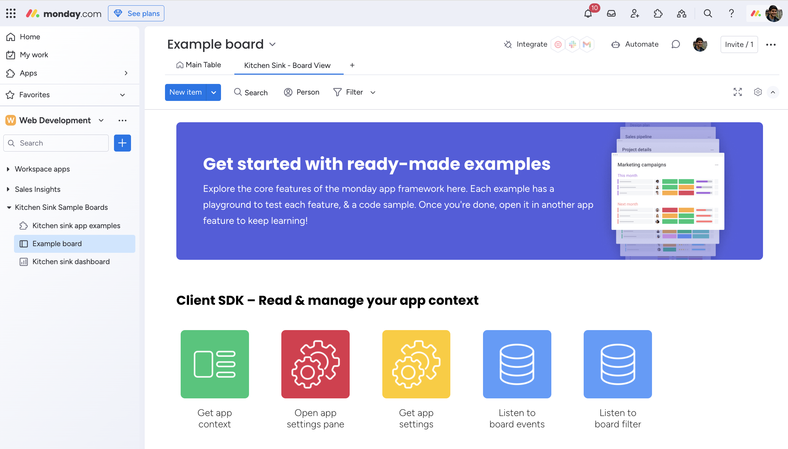
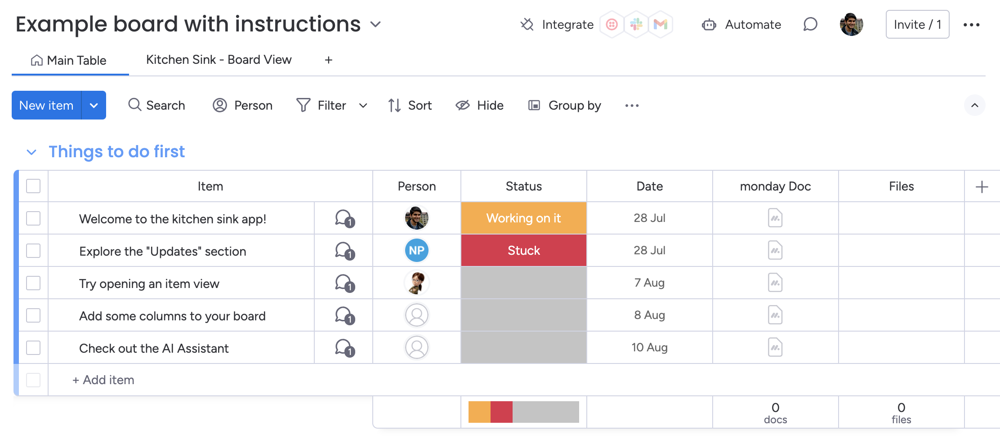

# Kitchen sink sample app

This sample app contains examples of functionality you need to know when building a monday app. Each example explains how the monday apps framework works and contains a code snippet. 



## Install the app on your demo account

Use this link to install the app in your demo account. 

<a href="https://auth.monday.com/oauth2/authorize?client_id=b1332d51359f7c186787f045f2cf6cb6&response_type=install">
  
</a>


If you're a developer who wants to build apps for the monday ecosystem, you can sign up for a free developer account. 

## Explore the examples

Once you've installed the app, there are two ways to use it: 
- Start from the bundled template
- Add one of the app features to your board

### Start from template

The app comes with a template to guide you through the monday apps framework. To use the template: 
1. Open the monday Template Center (+ icon in leftpane > Template Center)
2. Search for "Kitchen Sink Sample Boards"
3. Add the template to your workspace

The template contains 3 parts: 
- A board that explains the features of the app & monday
- A dashboard with the app pre-loaded on it
- A standalone Custom Object view, to use the app without a board or dashboard



### Add an app feature to your board

You can also open one of the app's features. Open a board and add any of the following features: 
- Board view
- Item view
- Object view (add this from the leftpane)
- Dashboard widget
- Account settings view (open this from the settings of another feature)
- AI assistant in board header
- AI assistant when writing an update section
- Item menu
- Group menu
- Batch action menu

## Run the app locally

After downloading the source code, follow these steps to run the app locally:

1. Run `nvm use` – this app uses node 18
2. Run `npm install` then `npm run start`
3. Paste monday tunnel URL into the feature you want

### Build the app

1. `npm run build` to generate build folder
2. Zip files in build folder (not folder itself)
3. Upload ZIP to monday

### Add a new code sample

1. Add component folder to src/examples/ folder
2. Add a route:
  1. Add route path to `src/Menu/MenuConstants` > Routes
  2. Add route to router in `index.js`
3. Add the component to menu
  1. Add component to `src/Menu/MenuConstants.js` so it renders in the main menu
4. Add a code sample
  1. Add component name and path to 'filesToGenerateSamples' in `generateCodeSamples.js`
  2. Add @mondaycom-code-sample-start and @mondaycom-code-sample-end comments to indicate start and finish of sample
  3. Run `npm run build:generate-samples` to update sample code

### Working boilerplate:

Use the following boilerplate to start a new sample:

```js
import React, { useState } from "react";
import mondaySdk from "monday-sdk-js";
import { useAppContext } from "../../hooks/UseAppContext";
import ActionHeader from "../../components/common/ActionHeader/ActionHeader";
import CodeBlock from "../../components/common/CodeBlock/CodeBlock";
import Instructions from "../../components/common/Instructions/Instructions";
import CodeSamples from "../../constants/codeSamples";
import Button from "monday-ui-react-core/dist/Button";
import AttentionBox from "monday-ui-react-core/dist/AttentionBox";

const monday = mondaySdk();

const GetAppContext = () => {

    const appContext = useAppContext();
    const [confirmed, setConfirmed] = useState(false);
    const [showMessage, setShowMessage] = useState(0);
    console.log({appContext});
    
    const getContextConstants = {
        confirmationInstructionsParagraphs: [`Opens a confirmation dialog to the user type 'confirm'`],
        confirmationInstructionslinkToDocumentation: `https://github.com/mondaycom/monday-sdk-js#mondayexecutetype-params`,
        confirmationInstructionsListItems: [
          `Call execute Monday's sdk method with "confirm" parameter sending the message content, buttons text.`,
        ],
        githubUrl: "Confirmation/Confirmation.jsx",
      };

    const handleConfirmation = () => {
        console.log('done');
    }

    return (
        <div className="confirmation-container feature-container">
          {/* @mondaycom-codesample-skip-block-start */}
          <CodeBlock contentText={'sdfsd'} /> 
          <ActionHeader action="Confirmation Pop Up" actionDescription="Using the SDK, open a confirmation pop up" />
          <div className="confirmation-content working-with-the-board-items">
            <h3 className="playground-header">Playground</h3>
            {/* @mondaycom-codesample-skip-block-end */}
            {showMessage === 0 && <Button style={{ width: "30%", margin: "30px 0" }} onClick={handleConfirmation}>
              Click Me
            </Button>}
            {showMessage !== 0 && confirmed && <AttentionBox type="success" text="Confirmed" title="Lets go!" />}
            {showMessage !== 0 && !confirmed && <AttentionBox type="danger" text="Denied" title="No way" />}
          </div>
          {/* @mondaycom-codesample-skip-block-start */}
          <Instructions
            paragraphs={getContextConstants.confirmationInstructionsParagraphs}
            instructionsListItems={getContextConstants.confirmationInstructionsListItems}
            linkToDocumentation={getContextConstants.confirmationInstructionslinkToDocumentation}
          />
          {/* @mondaycom-codesample-skip-block-end */}
        </div>
      );
}

export default GetAppContext;
```

## Getting help

Need help or have any questions? Post in the [monday developer community](https://community.monday.com/c/developers/8) or [open a support ticket.](https://support.monday.com/hc/en-us/requests/new?ticket_form_id=13855862562962)
